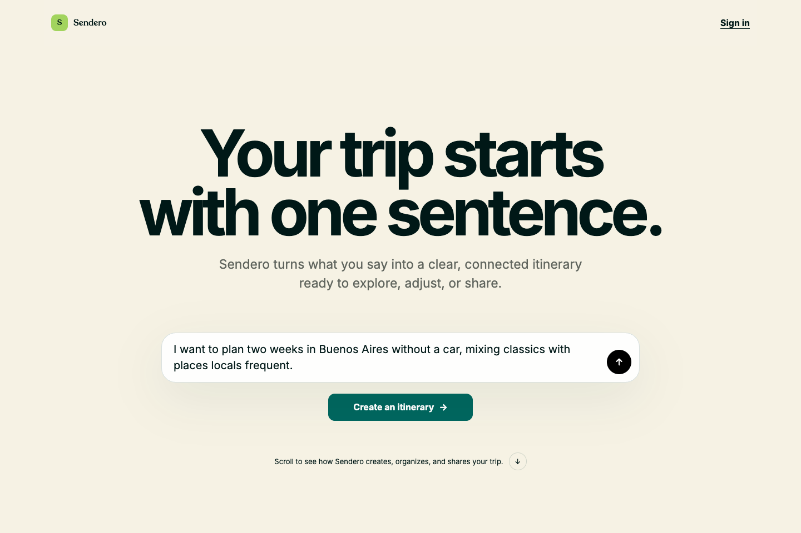

# Sendero

**Turn a conversation into a live itinerary that people and AI agents can plan, validate, review, save, and share together.**

[Open the live WebMCP experience](https://sendero-alpha.vercel.app/app/new?lang=en) · [Challenge implementation notes](CHALLENGE.md)



Sendero is a conversational travel planner built around a simple idea: the itinerary should live where the traveler can inspect it, while an AI agent should be able to use narrow, page-scoped capabilities to work with that same state. A traveler can describe a trip naturally, let ChatGPT research and construct the itinerary, review the validated result in Sendero, and sign in only when they want to save or share it.

The public planning flow works without an account. Saving, collaboration, public publishing, and persistent reservation tracking require authentication and explicit user intent.

## Why WebMCP

Without WebMCP, a chat can suggest an itinerary but cannot reliably update the exact Sendero page the traveler is viewing. Copying prompts and JSON between products also leaves the user without authoritative progress, validation, or save state.

Sendero registers site tools against the open page through `document.modelContext.registerTool`. This lets the agent:

1. read the facts already provided in the conversation and prepare the page without manually filling the form;
2. load Sendero's versioned planning protocol and schema;
3. stage a complete itinerary only after validating it;
4. make the validated result appear immediately in the page's list, calendar, route, map, and reservation views;
5. save or share only after the user explicitly asks and the page confirms the authoritative result.

The visible UI and the agent operate on the same browser-scoped draft. WebMCP is not a hidden remote shortcut: it is the bridge between the conversation and the page the person is actively reviewing.

## Site tools

### Itinerary creation page

The live creation page registers eight tools:

| Tool | What it does |
| --- | --- |
| `get_itinerary_planning_protocol` | Loads the prepared brief, versioned instructions, and canonical itinerary schema. |
| `validate_and_stage_itinerary` | Validates a complete itinerary and places it in the current browser's persistent draft cache. |
| `get_staged_itinerary` | Reads the validated browser draft and its warnings. |
| `update_itinerary_reservation_statuses` | Tracks specific booked or pending reservations after authentication; it never purchases anything. |
| `save_staged_itinerary` | Saves an explicitly approved draft to the authenticated Sendero account. |
| `share_saved_itinerary_by_link` | Publishes an explicitly requested read-only link for a saved trip. |
| `invite_saved_itinerary_member` | Invites an exact email as a private viewer or editor after explicit approval. |
| `discard_staged_itinerary` | Removes only the selected local draft, never a saved trip. |

### Public shared-trip page

A published itinerary registers six additional read-only or temporary-view tools:

| Tool | What it does |
| --- | --- |
| `get_shared_trip_context` | Reads dates, timezone, available days, publication version, and viewer permissions. |
| `get_day_itinerary` | Reads the ordered public itinerary for one date. |
| `preview_guest_arrival` | Shows which public items a late-arriving guest may miss and highlights a meeting point. |
| `show_day_on_map` | Opens one published day in the route and map view. |
| `focus_itinerary_item` | Focuses one public activity and its location. |
| `clear_guest_preview` | Clears temporary arrival and item focus without modifying the itinerary. |

Tool inputs use closed JSON schemas. Errors are returned as compact safe objects, itinerary text is treated as untrusted data, and the public tools never receive the share token or expose private reservation details.

## Human and agent experience

```text
Traveler describes a trip in ChatGPT
  -> ChatGPT calls the open Sendero page's planning tool
  -> Sendero reflects the brief and shows generation progress
  -> ChatGPT researches and constructs the itinerary
  -> Sendero validates and stages the result in the browser
  -> Traveler reviews list, calendar, routes, map, and reservations
  -> Traveler may discard, sign in to save, invite people, or publish read-only
```

The same page also remains usable manually. If WebMCP is unavailable, the traveler can complete the form and copy the generated handoff prompt. Sendero never claims that a trip was saved, shared, invited, booked, or purchased without the corresponding authoritative result.

## Architecture

```text
ChatGPT desktop in-app browser / WebMCP-enabled browser
  -> React page + TanStack Query browser cache
  -> page-scoped WebMCP facade and JSON-schema validation
  -> Hono application on Vercel
  -> Convex persistence and collaboration
  -> Auth0 authentication for account-only actions
```

Key implementation paths:

- `web/src/generate/webmcp.js` — creation-page tool contracts and registration.
- `web/src/generate/generation-client.js` — browser facade and staging lifecycle.
- `web/src/generate/GenerateTripApp.jsx` — visible planning, progress, review, and account gates.
- `web/src/share/webmcp.js` — public shared-page tool contracts and registration.
- `web/src/share/shared-trip-companion.js` — safe public facade and arrival preview.
- `web/src/share/PublicShareApp.jsx` — shared itinerary UI and temporary page feedback.
- `server/app.mjs` — Hono routes, capability flags, APIs, and deployment entry point.
- `convex/` — trips, revisions, invitations, public snapshots, permissions, and reservation state.

## Run locally

Sendero requires Node.js 22.

```bash
npm install
cp .env.example .env.local
npm test
npm run dev
```

The local application is available at `http://localhost:8788`. The itinerary creation page is `http://localhost:8788/app/new?lang=en`, the MCP endpoint is `http://localhost:8788/mcp`, and the health check is `http://localhost:8788/health`.

`SENDERO_WEBMCP_PLANNING_ENABLED=true` enables the creation-page capability in an environment. Copy the placeholder configuration from `.env.example`; never commit deployment keys, Auth0 secrets, session keys, invitation peppers, email credentials, or Google API keys.

## Test WebMCP

1. Open `https://sendero-alpha.vercel.app/app/new?lang=en` in ChatGPT's desktop in-app browser, or in Google Chrome 149+ with WebMCP enabled.
2. Confirm that the page's WebMCP indicator lists eight available commands.
3. Ask the active agent to create a trip using facts supplied in natural language.
4. Watch the page move from trip details to generation and then to the validated review.
5. Review calendar, routes, map, reservations, warnings, and source-backed uncertainty.
6. Optionally sign in to save. Sharing and invitation actions remain separately permissioned and require explicit instructions.

For a normal-browser UI preview without site tools:

```bash
npm run preview:ui
```

## Verification

```bash
npm run check
SENDERO_SMOKE_BASE_URL=https://sendero-alpha.vercel.app npm run smoke:remote
```

The test suite covers tool registration, schemas, staging, anonymous browser persistence, authenticated save and share boundaries, itinerary presentation, responsive UI, and public projection privacy. Challenge provenance and the verified production boundary are documented in [CHALLENGE.md](CHALLENGE.md).

## License

Sendero's original source code is released under the [MIT License](LICENSE). Third-party packages remain under their own licenses; see [THIRD_PARTY_NOTICES.md](THIRD_PARTY_NOTICES.md), including the separate terms that apply to GSAP.
